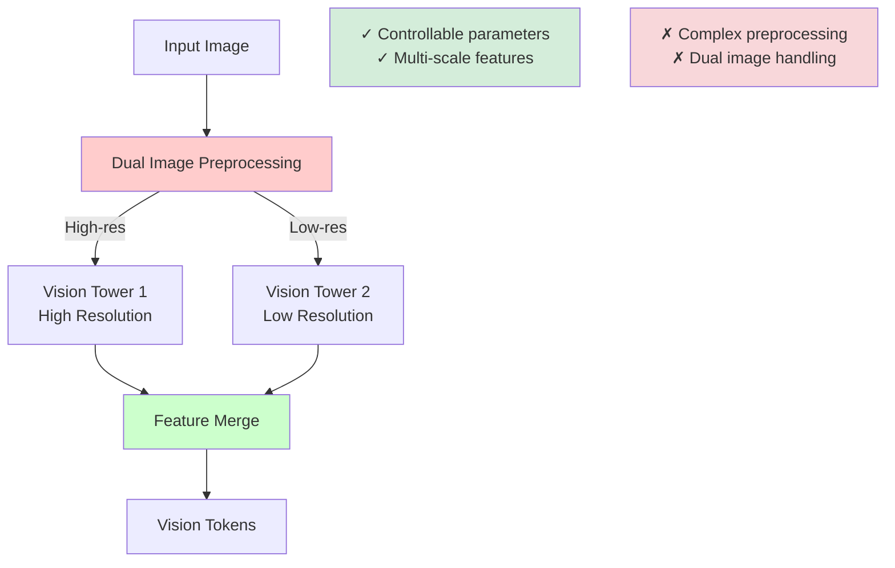
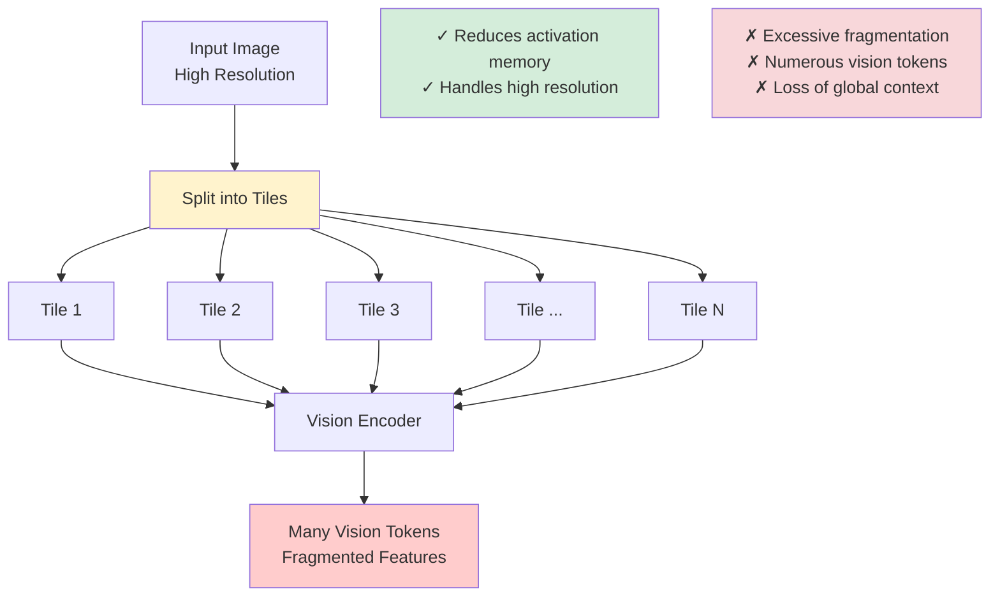
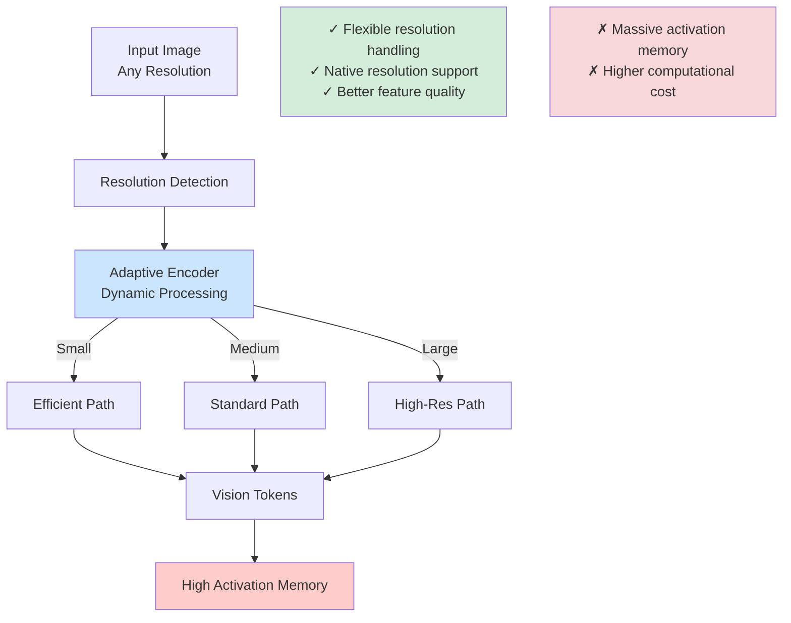
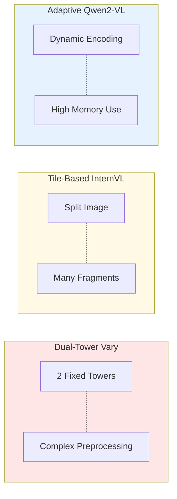
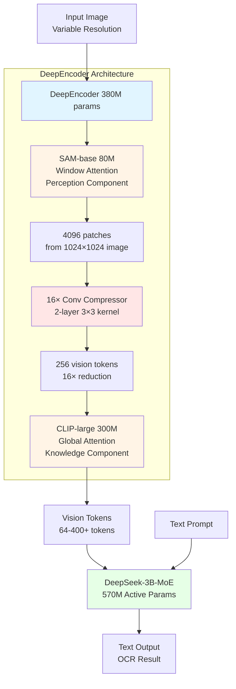
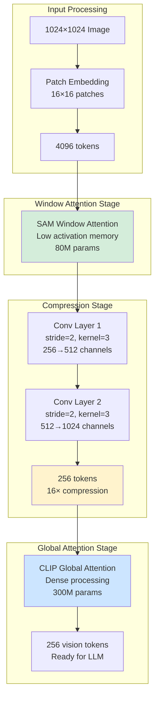
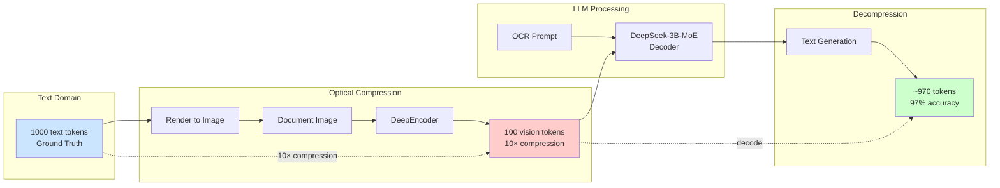
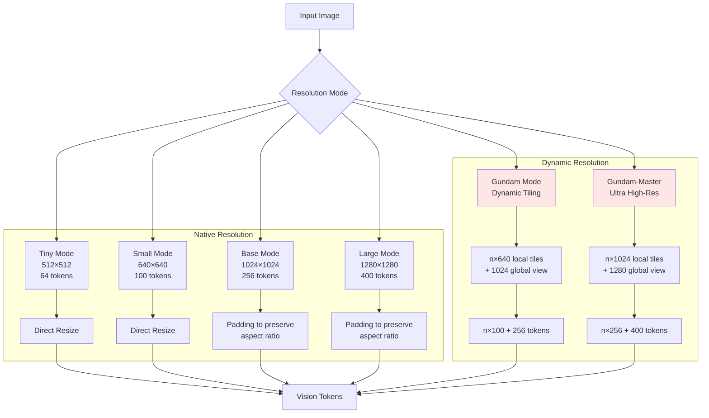
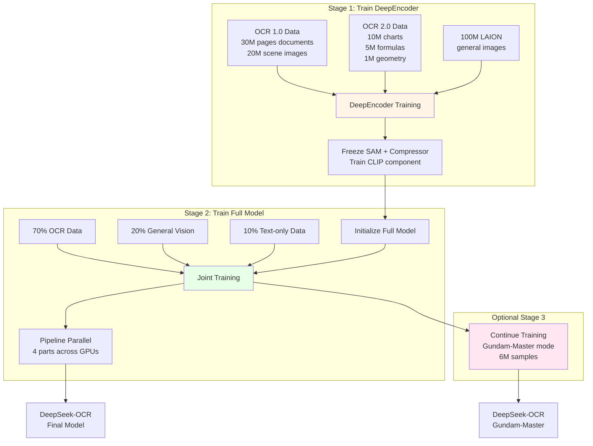
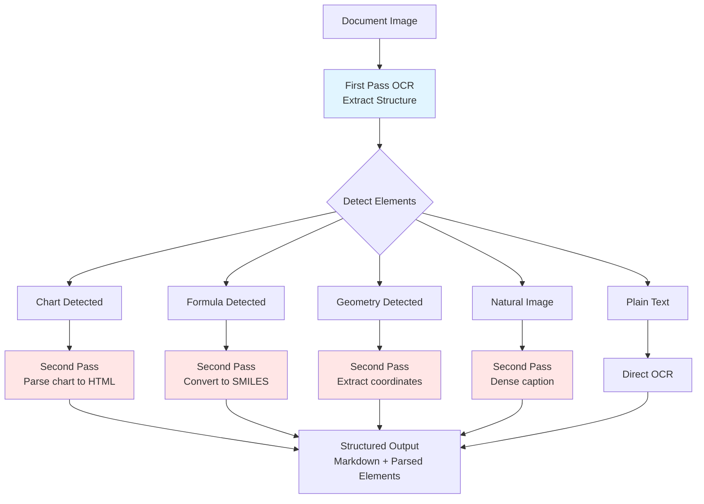

## Dual-Tower Architecture (Vary)

## Tile-based (InternVL2.0): lower activation memory; many tokens / fragmentation

## Adaptive-resolution (Qwen2-VL): flexible resolution; high activation memory

## Comparison Summary

# DeepSeek-OCR Architecture Overview

## Key Concepts

**Core Innovation**: DeepSeek-OCR explores optical context compression by converting text into images, achieving 10-20× compression ratios. At 10× compression (1000 text tokens → 100 vision tokens), the model maintains 97% OCR accuracy, while 20× compression still retains 60% accuracy. This approach could enable efficient long-context processing by rendering older dialogue history into progressively smaller images, mimicking human memory decay.

**Architecture Design**: The 380M-parameter DeepEncoder combines an 80M SAM encoder (window attention for perception) with a 300M CLIP encoder (global attention for knowledge). A 16× convolutional compressor bridges them, reducing 4096 patches to 256 tokens before expensive global attention. This serial design maintains low activation memory at high resolutions. The decoder uses DeepSeek-3B-MoE with 570M active parameters.

**Practical Performance**: DeepSeek-OCR outperforms existing models with fewer tokens—beating GOT-OCR2.0 using just 100 tokens (vs 256) and MinerU2.0 using <800 tokens (vs 6000+). It supports multiple resolution modes (64-400+ tokens) in a single model and processes ~100 languages. Production deployment achieves 200K+ pages/day on a single A100-40G, with "deep parsing" capabilities for charts, formulas, geometry, and natural images.

## Overall DeepSeek-OCR Architecture

## Vision Token Compression Strategy

## Compression-Decompression Concept

## Multi-Resolution Support Modes

## Training Pipeline

## Deep Parsing Capability

