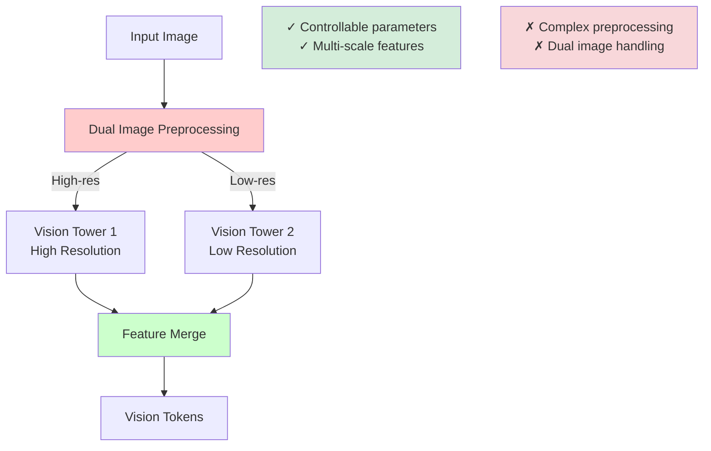
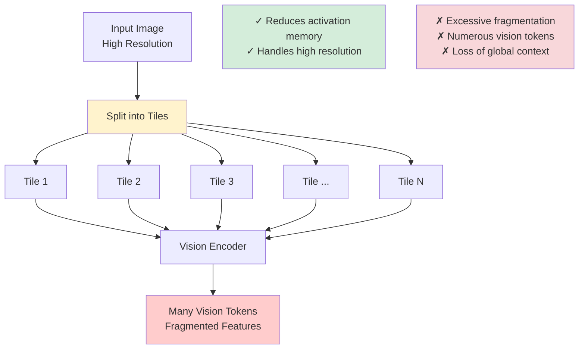
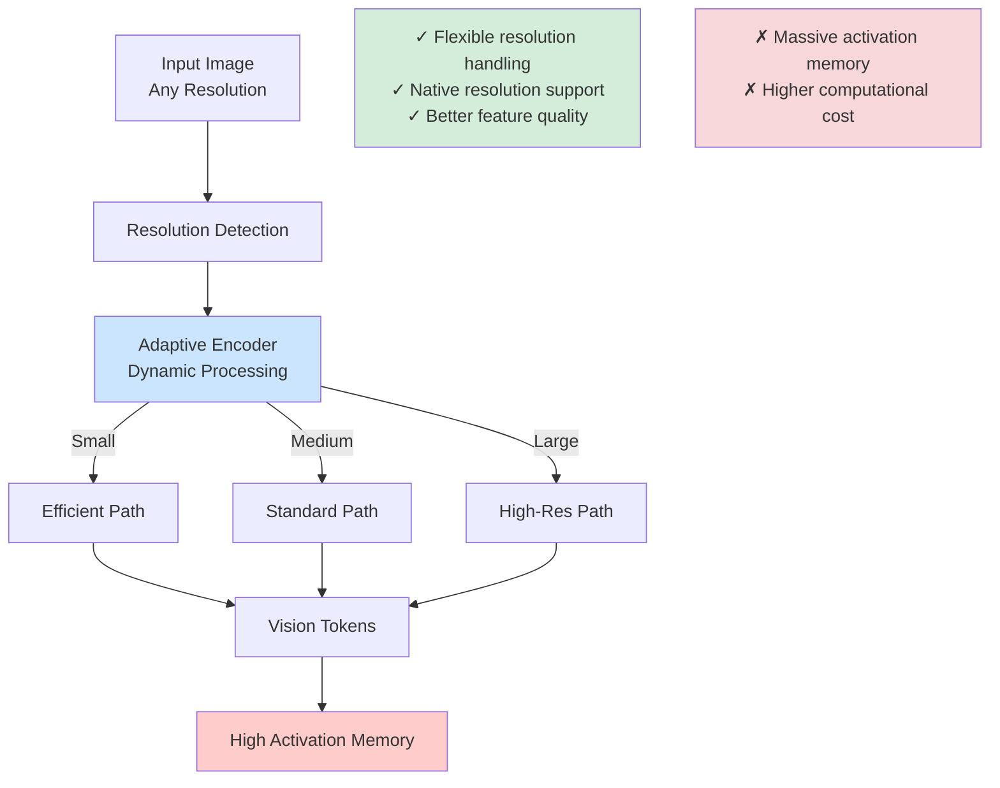

## Dual-Tower Architecture (Vary)

```mermaid
graph TB
    IMG[Input Image] --> PRE[Dual Image Preprocessing]
    PRE --> |High-res| TOWER1[Vision Tower 1<br/>High Resolution]
    PRE --> |Low-res| TOWER2[Vision Tower 2<br/>Low Resolution]
    TOWER1 --> MERGE[Feature Merge]
    TOWER2 --> MERGE
    MERGE --> TOKENS[Vision Tokens]
    
    style PRE fill:#ffcccc
    style MERGE fill:#ccffcc
    
    PROS[✓ Controllable parameters<br/>✓ Multi-scale features]
    CONS[✗ Complex preprocessing<br/>✗ Dual image handling]
    
    style PROS fill:#d4edda
    style CONS fill:#f8d7da
```

## Tile-Based Methods (InternVL2.0)

```mermaid
graph TB
    IMG[Input Image<br/>High Resolution] --> SPLIT[Split into Tiles]
    SPLIT --> T1[Tile 1]
    SPLIT --> T2[Tile 2]
    SPLIT --> T3[Tile 3]
    SPLIT --> TD[Tile ...]
    SPLIT --> TN[Tile N]
    
    T1 --> ENC[Vision Encoder]
    T2 --> ENC
    T3 --> ENC
    TD --> ENC
    TN --> ENC
    
    ENC --> TOKENS[Many Vision Tokens<br/>Fragmented Features]
    
    style SPLIT fill:#fff3cd
    style TOKENS fill:#ffcccc
    
    PROS[✓ Reduces activation memory<br/>✓ Handles high resolution]
    CONS[✗ Excessive fragmentation<br/>✗ Numerous vision tokens<br/>✗ Loss of global context]
    
    style PROS fill:#d4edda
    style CONS fill:#f8d7da
```

## Adaptive Resolution Encoding (Qwen2-VL)

```mermaid
graph TB
    IMG[Input Image<br/>Any Resolution] --> DETECT[Resolution Detection]
    DETECT --> ADAPT[Adaptive Encoder<br/>Dynamic Processing]
    
    ADAPT --> |Small| PATH1[Efficient Path]
    ADAPT --> |Medium| PATH2[Standard Path]
    ADAPT --> |Large| PATH3[High-Res Path]
    
    PATH1 --> TOKENS[Vision Tokens]
    PATH2 --> TOKENS
    PATH3 --> TOKENS
    
    TOKENS --> MEM[High Activation Memory]
    
    style ADAPT fill:#cce5ff
    style MEM fill:#ffcccc
    
    PROS[✓ Flexible resolution handling<br/>✓ Native resolution support<br/>✓ Better feature quality]
    CONS[✗ Massive activation memory<br/>✗ Higher computational cost]
    
    style PROS fill:#d4edda
    style CONS fill:#f8d7da
```